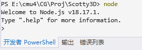
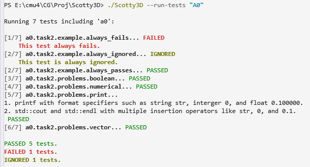

# A0 – Scotty3D Setup & Debugging

## Overview
Establishes a reliable development and debugging workflow for the Scotty3D C++ graphics engine.

---

## A0T1 – Build Your Scotty3D

**Requirement (summary):**
- Clone Scotty3D and complete environment setup
- Build and run Scotty3D in GUI and test modes

### Result

Step 1: Clone

Step 2: General Setup

Visual Studio:

Node:

Nest-libs:

Step 3: Build and Run

---

## A0T2 – Debugging in CLI

**Requirement (summary):**
- Fix broken test functions (without changing the general approach)
- Ensure all tests pass

### Result

---

## A0T3 – Debugging in GUI

**Requirement (summary):**
- Reproduce a GUI crash (mesh replacement to pentagon)
- Use debugger/call stack to locate and fix the underlying issue

### Result

---

Author: Chuang Ma
