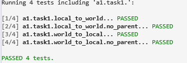
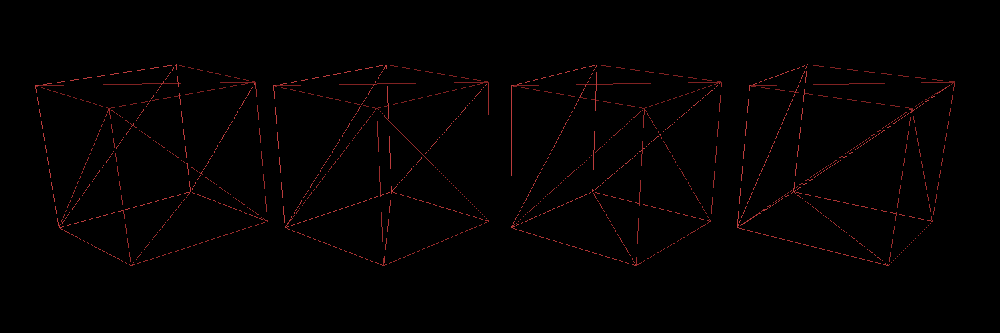
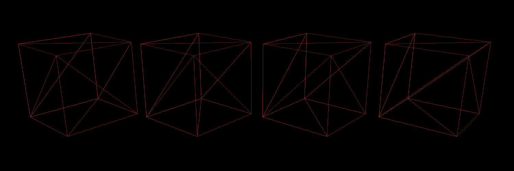
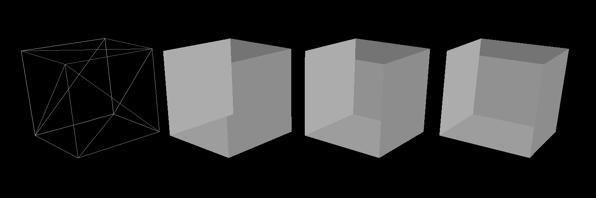
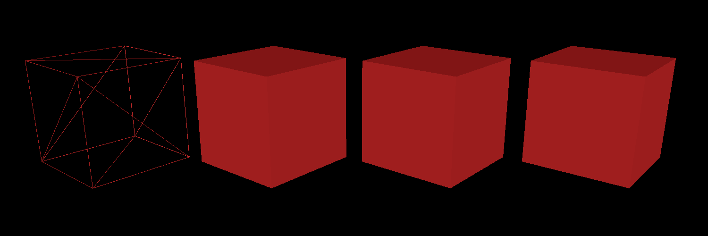
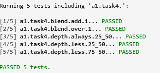
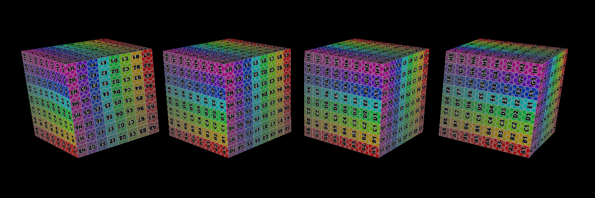
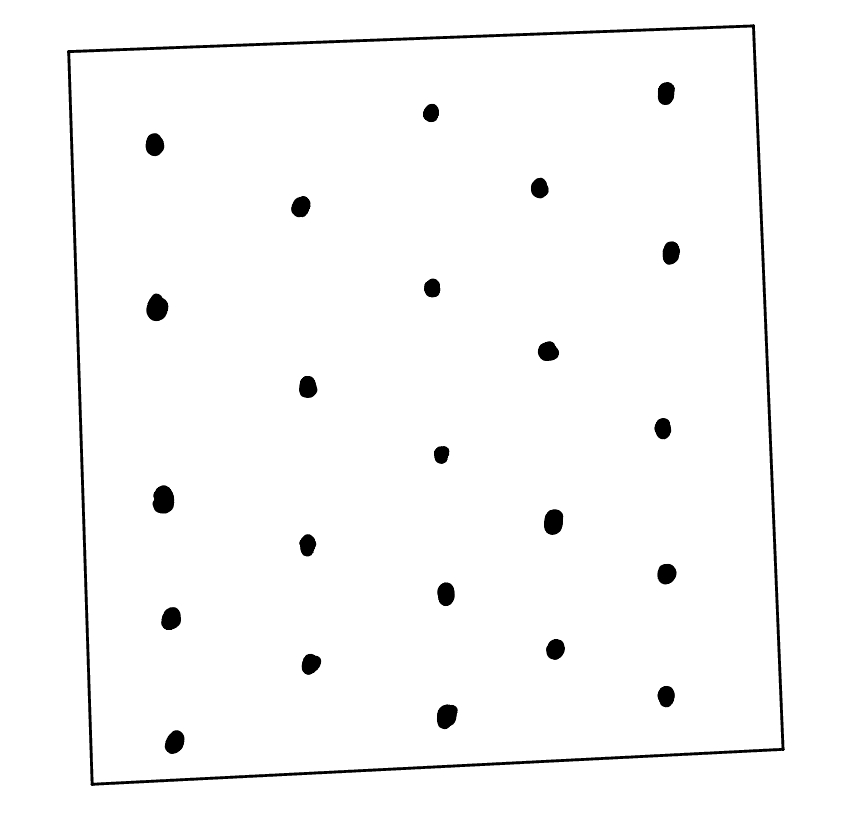
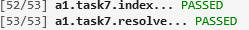
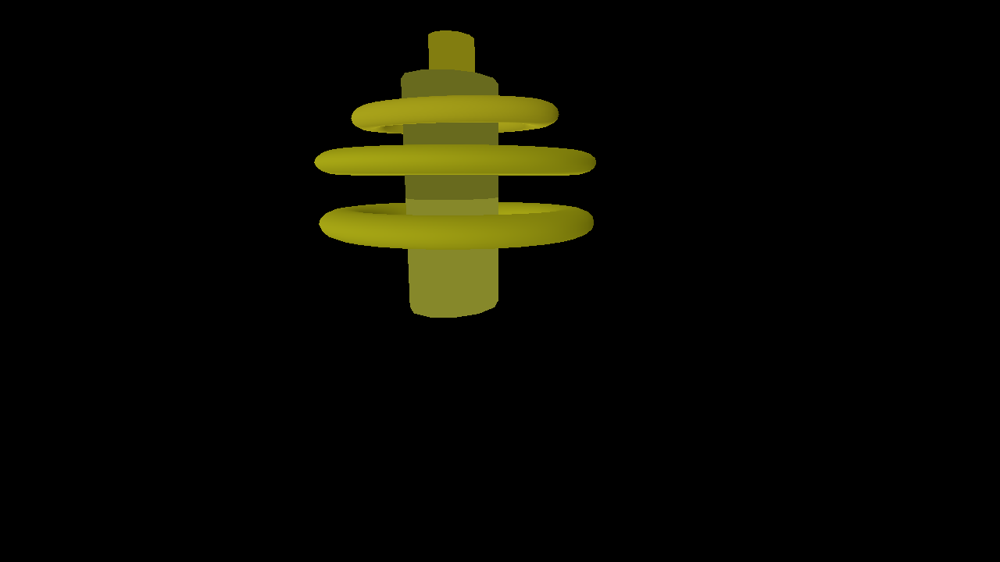

# A1 – Software Rasterization Pipeline

## Overview
Implements a complete software rasterization pipeline in C++, mirroring the core stages of a modern GPU.

---

## A1T1 – Scene Transformations

**Requirement (summary):**
Implement `local_to_world` and `world_to_local` for hierarchical transforms.

### Result

---

## A1T2 – Line Rasterization

**Requirement (summary):**
Rasterize wireframe lines (diamond-exit rule), handle endpoint edge cases, pass tests.

### Result

All red:

With different color:

Pass all tests including Piazza's:

---

## A1T3 – Flat Triangle Rasterization

**Requirement (summary):**
Rasterize flat-shaded triangles efficiently; handle shared edges with top-left rule.

### Result

---

## A1T4 – Depth Testing & Blending

**Requirement (summary):**
Implement depth-less testing and blending (Add, Over). Answer blend/depth questions.

### Result

Three colors (one valid configuration):
- Red: Blend Replace, Depth Always
- Green: Blend Replace, Depth Always
- Blue: Blend Replace, Depth Always

Five colors (one valid configuration):
- Red: Blend Add, Depth Always
- Green: Blend Add, Depth Always
- Blue: Blend Add, Depth Always

Additional results:

---

## A1T5 – Attribute Interpolation (Smooth & Perspective-Correct)

**Requirement (summary):**
Implement screen-space + perspective-correct interpolation and compute derivatives.

### Result

---

## A1T6 – Mipmapping

**Requirement (summary):**
Implement LOD, mip generation, and texture sampling.

### Result

---

## A1T7 – Supersampling

**Requirement (summary):**
Support multi-sample framebuffer indexing, resolve, and a custom sample pattern.

### Result

Sample pattern:

Explanation:
I alternate sampling points between odd/even sequences (5 points vs 4 points). Distances between points stay constant, but edge-to-boundary distances differ. This may help irregular shapes but can be less effective on highly regular images.

Final test:

---

## Final Rasterized Image

Description:
I tried to create a sci-fi teleportation point with a surrounding halo. The final result looks closer to a cylindrical space station with a ring, built from two cylinders plus an outer ring.

---

Author: Chuang Ma
