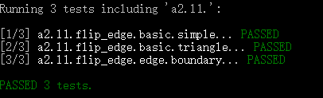
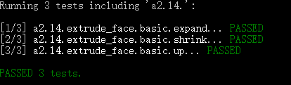
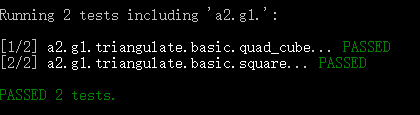
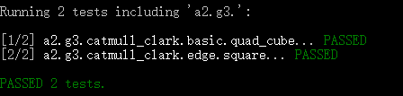
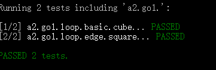
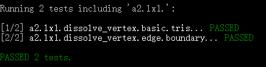
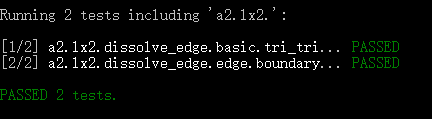
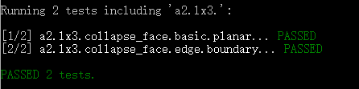
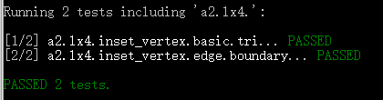

# A2 – Halfedge Mesh Editing & Subdivision

## Overview
Implement interactive mesh editing using a Halfedge mesh data structure, including local topology ops, global geometry processing, and optional extra credit operations.

---

## A2L1 – Flip Edge (IMPLEMENTED)

**Requirement (summary):**
Flip a non-boundary edge; handle invalid/edge cases gracefully.

### Result

Edge cases handled:
1) edge on boundary  
2) non-manifold-like multiple-triangle situations  
3) internal boundary-like shape cases

---

## A2L2 – Split Edge (IMPLEMENTED)

**Requirement (summary):**
Split an edge, add a midpoint vertex, subdivide adjacent non-boundary faces.

### Result

Edge cases handled:
1) split edge on boundary  
2) triangle-only face cases

---

## A2L3 – Collapse Edge (IMPLEMENTED)

**Requirement (summary):**
Collapse an edge if valid; otherwise do nothing and return nullopt.

### Result

Edge cases handled:
1) boundary edge  
2) triangle face degeneracy (face becomes a line)  
3) pyramid/bottom-edge type cases

---

## A2L4 – Extrude Face (IMPLEMENTED)

**Requirement (summary):**
Extrude face to create a ring of quads; support later translation/shrink.

### Result

Edge cases handled:
1) face is boundary  
2) shrink <= 1

---

## A2G1 – Triangulation (IMPLEMENTED)

**Requirement (summary):**
Triangulate polygonal faces.

### Result

---

## A2G2 – Linear Subdivision Positions (IMPLEMENTED)

**Requirement (summary):**
Compute positions for linear subdivision (Catmull-Clark style without smoothing).

### Result

---

## A2G3 – Catmull–Clark Subdivision Positions (IMPLEMENTED)

**Requirement (summary):**
Compute Catmull–Clark positions (careful with boundaries).

### Result

---

## A2GO1 – Loop Subdivision (CHOICE, IMPLEMENTED)

**Requirement (summary):**
Implement Loop subdivision for triangle meshes (boundary rules included).

### Result

---

## Extra Credit

### A2LX1 – Dissolve Vertex (IMPLEMENTED)

Edge cases:
- vertex on boundary

### A2LX2 – Dissolve Edge (IMPLEMENTED)

Edge cases:
- edge on boundary

### A2LX3 – Collapse Face (IMPLEMENTED)

Edge cases:
- face on boundary

### A2LX4 – Inset Vertex (IMPLEMENTED)

Edge cases:
- face on boundary

### A2LX7 – Make Boundary (IMPLEMENTED)

Edge cases:
- boundary-related

### A2LX8 – Weld Edges (IMPLEMENTED)

Edge cases:
- boundary-related

---
Author: Chuang Ma
