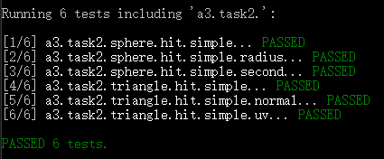
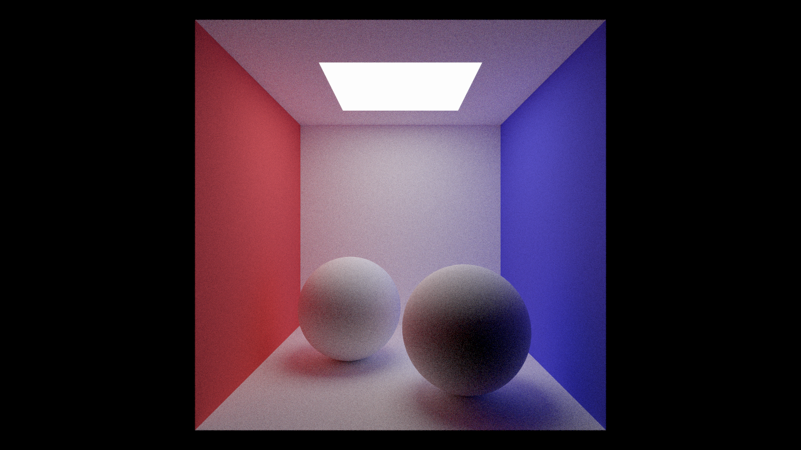
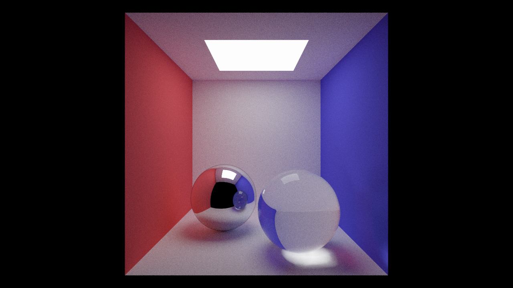
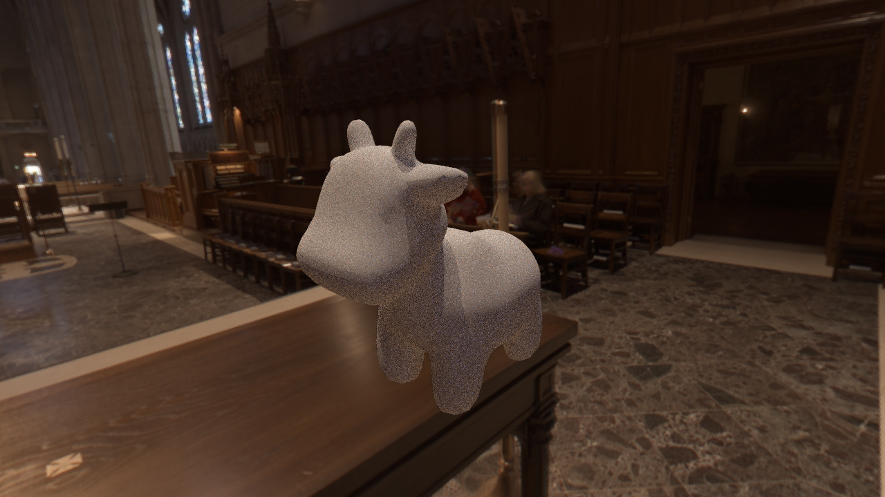
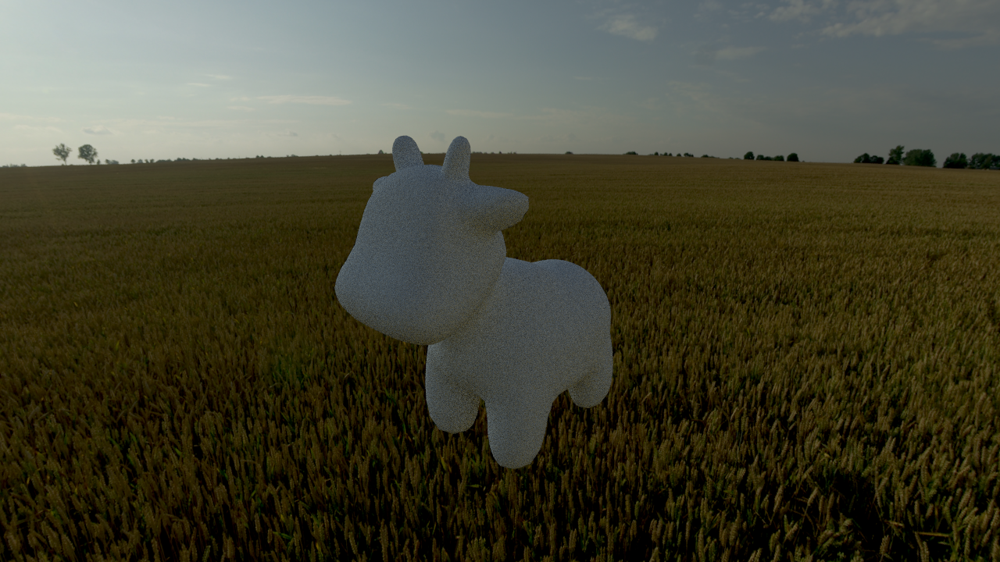
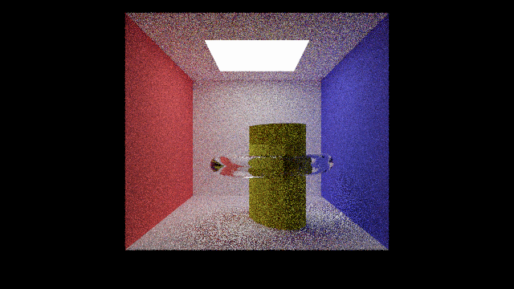

# A3 – Path Tracing Renderer

## Overview
Build a physically-based path tracer in Scotty3D, including ray generation, intersections, BVH acceleration, path tracing with materials, and direct/environment lighting.

---

## A3T1 – Camera Rays

**Requirement (summary):**
Generate camera rays that correctly fill the view frustum.

### Result

---

## A3T2 – Intersection Tests

**Requirement (summary):**
Implement ray–sphere and ray–triangle intersections.

### Result

---

## A3T3 – BVH

**Requirement (summary):**
Build and traverse BVH for efficient ray-scene intersection.

### Result

---

## A3T4 – Path Tracing

**Requirement (summary):**
Implement recursive path tracing integrator (Lambertian correctness).

### Result

---

## A3T5 – Materials

**Requirement (summary):**
Support mirror/refraction/glass materials.

### Result

---

## A3T6 – Direct Lighting

**Requirement (summary):**
Improve quality/speed via direct lighting sampling.

### Result

---

## A3T7 – Environment Lighting

**Requirement (summary):**
Implement environment map importance sampling (CDF/PDF usage, Jacobian, correct parameterization).

### Result

---

## Final Rendered Image

Scene description:
I placed my modeled object from previous HW into the Cornell-box-like scene, replacing the two spheres, and tested different materials (mirror/glass) for the surrounding ring.

Additional renders:

---

Author: Chuang Ma
