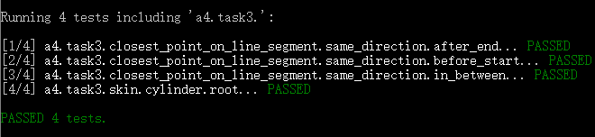
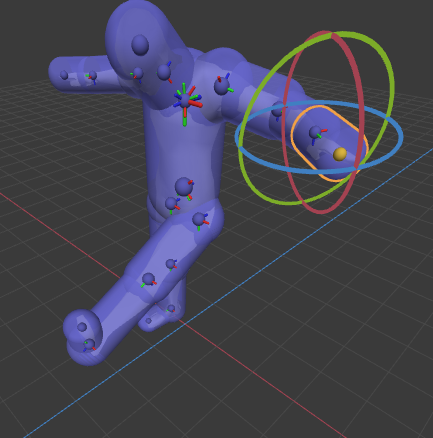
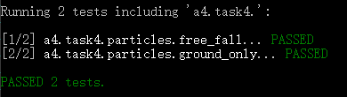
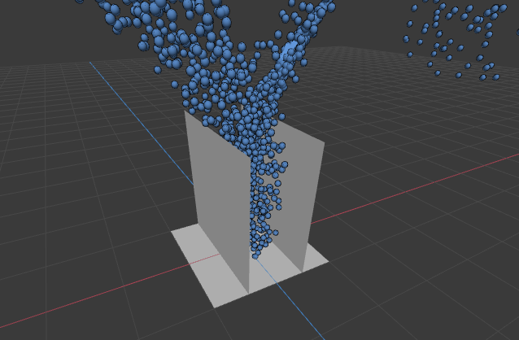
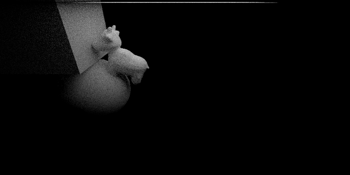

# A4 – Animation: Splines, Skeleton, Skinning, Particles

## Overview
Complete Scotty3D’s animation system including spline interpolation, skeletal kinematics (FK/IK), linear blend skinning, and particle simulation with collisions.

---

## A4T1 – Spline Interpolation

**Requirement (summary):**
Implement spline interpolation; validate correctness via tests and visual behavior.

### Result

---

## A4T2 – Skeleton Kinematics (FK/IK)

**Requirement (summary):**
Implement skeleton hierarchy transforms and IK; verify bone manipulation correctness.

### Result

---

## A4T3 – Linear Blend Skinning (LBS)

**Requirement (summary):**
Implement skinning so the mesh deforms correctly under skeleton motion.

### Result

---

## A4T4 – Particle Simulation

**Requirement (summary):**
Simulate particles with collisions; particles should not tunnel through surfaces.

Note from my write-up:
I do **not** want to use reference A3T2 solutions for this task (answered “no”), but if anything is wrong, please try reference (I believed my T2 is correct).

### Result

---

## Animated Video (FINAL)

Animation file:
- please check `animation2.mp4`

Description:
A cow moves and jumps on a ball, then continues moving until being stopped by a cube.

Key frames:

---

Author: Chuang Ma
