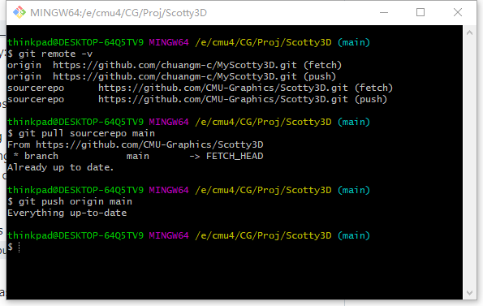
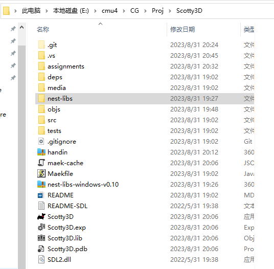
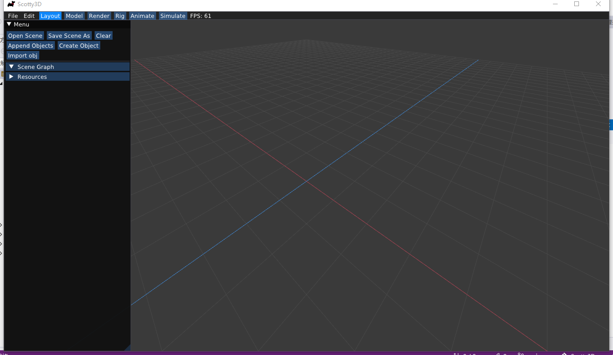

**Assignment 0 Report**

AndrewID: chuangm

## About this template

* You can view your writeup by opening it in a browser - right click this file and open with your browser of choice.

* Replace reference images with your own screenshots or renders when applicable.

* Include descriptions of any encountered problems and the time you spent on each task.

## A0T1

Step 1: Clone

or

Step 2: General Setup

Visual Studio:

Node:

Nest-libs:

Step 3: Build and Run

## A0T2

You do not need any screenshots for this task. Your completion will be graded based on your `test.a0.task2.problems.cpp` file.

## A0T3

You do not need any screenshots for this task. Your completion will be graded based on your `src` submission.

## Feedback

Use this section to provide feedback about the assignment.
Task1:
encountered problems: Setting up env in VS is easier than VS Code in Windos.
To get the debug env set up in VS code took me a lot of time.
time spent: 3 hours

Task2:
This is much easier than task3.
time spent: 2 hours

Task3:
This is kind of difficult. It took me a lot of time to locate the error in Data pentagon(float r) in 'util.cpp'
I used to thought the problems are in somewhere else and done many other changes and still get wrong.
Then I spent time learning about halfedge meshes, then solved the problem.
time spent: 6 hours
